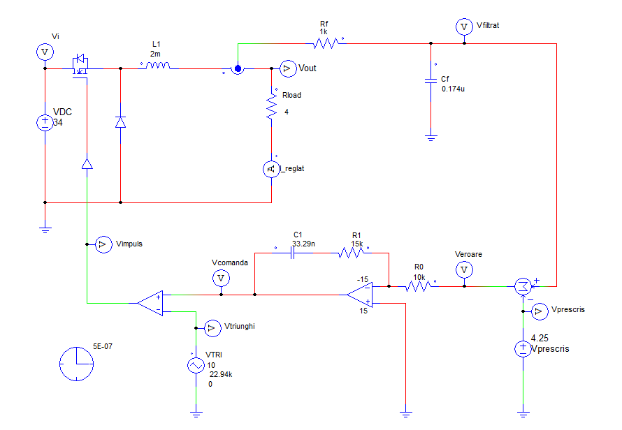
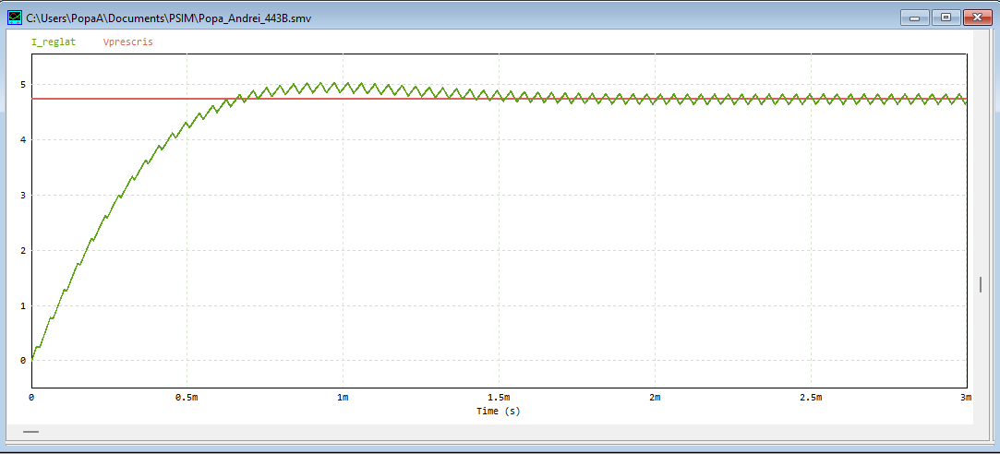
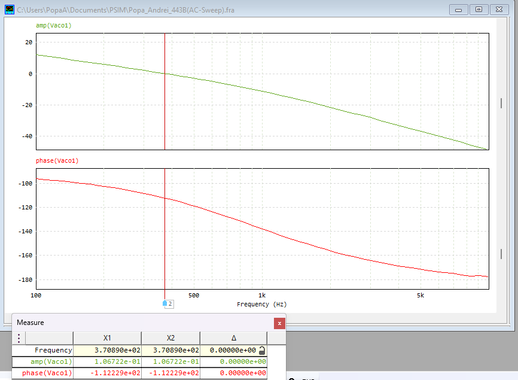

# PWM Current Control — One-Quadrant DC-DC Converter

> Design, tuning and stability verification of a closed-loop current regulator for a DC-DC converter.

## Overview

A current-control loop for a one-quadrant DC-DC converter driving an RL load, optimized for step
response. The work goes from analytical modeling of the plant, through PI-controller tuning, to
transient and frequency-domain validation in PSIM — with each result checked against theory.

## Design Specifications

| Parameter | Value |
|-----------|-------|
| Input voltage Vi | 34 V |
| Load inductance L | 2 mH |
| Load resistance R | 4 Ω |
| PWM frequency f_PWM | 22.974 kHz |
| Triangle amplitude Vtr | 10 V |
| Filter time constant Tf | 0.1741 ms |
| Reference current (Imax/2) | Vprescris = 4.25 V |

## Designed Components (regulator)

| Component | Value |
|-----------|-------|
| Measurement filter | Rf = 1 kΩ, Cf = 0.1741 µF |
| PI regulator | R0 = 10 kΩ, C1 = 33.29 nF, R1 = 15.01 kΩ |
| Load time constant τ = L/R | 0.5 ms |

## Approach

1. **Plant modeling** — derived the transfer functions of converter + load, current transducer and PWM modulator; linearized the non-linear converter around its operating point using averaged variables.
2. **Controller design** — tuned a **PI regulator with the modulus-optimum criterion** and sized the real component values from τ = R1·C1 and R0·C1 = 2·kext·TΣ.
3. **Transient validation (PSIM)** — step response (settling time, overshoot), duty cycle and current ripple, error signal.
4. **Robustness** — ±25 % / ±50 % supply variation, ±50 % load step, and a trapezoidal/ramp reference.
5. **Stability** — AC sweep → Bode plot → phase-margin measurement.

## Results — Theory vs. Simulation

| Quantity | Theory / target | Simulation (measured) | Note |
|----------|-----------------|-----------------------|------|
| Settling time | ≈ 0.93 ms (4.72·TΣ) | ≈ 0.82 ms | Good agreement |
| Overshoot | 2.7 % target | minimal | Well-damped step response |
| Steady-state duty cycle D | 57.4 % (Vo/Vi) | 58.3 % (tHigh/T) | ~1.5 % difference — excellent |
| Current ripple ΔI (nominal) | ≈ 0.10 A (formula) | ≈ 0.175 A | Analytical formula underestimates; see note |
| Phase margin | > 45 ° for stability | **67.8 °** | Circuit is **stable** |

**Robustness (steady-state ripple).** ±25 % supply: ΔI ≈ 0.202 A · ±50 % supply: ΔI ≈ 0.175 A · ±50 % load step: ΔI ≈ 0.138 A. For a **ramp/trapezoidal reference**, the loop shows a non-zero steady-state error — expected for a PI controller tracking a ramp.

### Analysis

The settling time, duty cycle and phase margin match theory closely, confirming the PI design and the
stability prediction. The measured current ripple is higher than the simplified analytical formula
predicts, because that formula assumes ideal continuous conduction and neglects the regulator dynamics
and measurement filter — a good example of where a closed-form approximation diverges from the real
switched circuit.

## Repository Structure

```
.
├── pwm-current-control-converter.pdf   # full write-up with derivations
├── images/                              # PSIM schematics, waveforms, Bode plot
└── README.md
```

## Supporting figures

<!-- Pick a few key screenshots from your PDF and drop them in images/ -->
-  <!-- Fig. 6 -->
-  <!-- Fig. 10 / 12 -->
-  <!-- Fig. 37 / 38 -->

## Skills Demonstrated

Closed-loop control design · PI tuning (modulus optimum) · power-electronics modeling and
linearization · frequency-domain stability (phase margin) · simulation-driven validation against
theoretical targets.

## Author

Andrei-Emanuel Popa · [andreipopae@gmail.com](mailto:andreipopae@gmail.com) ·
